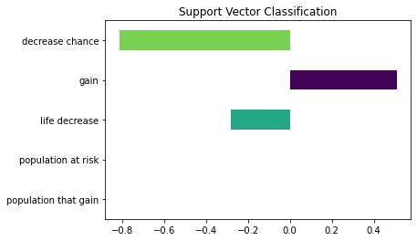
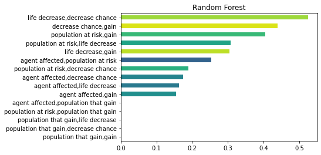

# Links
[Plant scenario](#results-on-plant-scenario-dataset!)

[Airplane Scenario new experiments](#results-on-new-airplane-scenario-dataset)

## Outcome of logistic regression on features of interest

Click to expand

### classifying by absolute value |high/low
|feature of interest	|GENDER|
|-|-|
|score			    |0.5576923076923077|
|USER.age		    |0.23099879888542799|
|USER.education		|-0.22248311939791085|
|USER.gender		    |0.46023922034878656|

### classifying by sign |positive/negative
|feature of interest	|GENDER|
|-|-|
|score		    	|0.5384615384615384|
|USER.age		    |0.32403621896403745|
|USER.education		|-0.37600122626233523|
|USER.gender	    	|0.2543134412454923|

### classifying by absolute value |high/low
|feature of interest|	AGE|
|-|-|
|score		    	|0.5|
|USER.age		    |0.18600745253291123|
|USER.education		|0.1756347245571809|
|USER.gender	    |	0.14999062012117734|

### classifying by sign |positive/negative
|feature of interest	|AGE|
|-|-|
|score			    |0.75|
|USER.age		    |0.48895660171022254|
|USER.education		|-0.29996988405598|
|USER.gender	    	|-0.43050207106048416|

### classifying by absolute value |high/low
|feature of interest	|CAREER.parent|
|-|-|
|score		    	|0.6153846153846154|
|USER.age		    |0.8240166619808316|
|USER.education		|0.18933944176951317|
|USER.gender		    |-0.10610176793079298|

### classifying by sign |positive/negative
|feature of interest	|CAREER.parent|
|-|-|
|score		    	|0.9038461538461539|
|USER.age	    	|-0.016410445044917368|
|USER.education		|1.003839788731196|
|USER.gender		    |0.11037628792268606|

### classifying by absolute value |high/low
|feature of interest	|CAREER.politician|
|-|-|
|score		    	|0.7115384615384616|
|USER.age	    	|0.13704587074410837|
|USER.education		|0.9350742294973488|
|USER.gender		    |-1.2304932129015043|

### classifying by sign |positive/negative
|feature of interest	|CAREER.politician|
|-|-|
|score		    	|0.7115384615384616|
|USER.age	    	|0.43319005856663406|
|USER.education		|0.5351080202707557|
|USER.gender		    |-0.8454205399892039|

### classifying by absolute value |high/low
|feature of interest	|CAREER.ex-convict|
|-|-|
|score			    |0.8846153846153846|
|USER.age	    	|0.24289827135137362|
|USER.education		|-0.0490810156579368|
|USER.gender		    |-0.23296884096618672|

### classifying by sign |positive/negative
|feature of interest	|CAREER.ex-convict|
|-|-|
|score			    |0.9230769230769231|
|USER.age		    |0.5720861210618439|
|USER.education		|-0.04383360412431551|
|USER.gender		    |0.02249831577278853|

### classifying by absolute value |high/low
|feature of interest	|HEALTH.terminal|
|-|-|
|score			    |0.5384615384615384|
|USER.age	    	|0.29605265802625996|
|USER.education		|0.3632112365893492|
|USER.gender		    |0.14958564884423986|

### classifying by sign |positive/negative
|feature of interest	|HEALTH.terminal|
|-|-|
|score			    |0.6153846153846154|
|USER.age		    |0.7573479355253138|
|USER.education		|-0.15628836326923676|
|USER.gender		    |0.05028296344959226|

### classifying by absolute value |high/low
|feature of interest|	HEALTH.healthy|
|-|-|
|score		    	|0.5384615384615384|
|USER.age	    	|0.18334226408958113|
|USER.education		|0.3644343721925291|
|USER.gender	    |	0.142990194536625|

### classifying by sign |positive/negative
|feature of interest	|HEALTH.healthy|
|-|-|
|score			    |0.6730769230769231|
|USER.age		    |0.5895135393521647|
|USER.education		|0.10300505346704315|
|USER.gender		    |-0.5137116792104153|

## Written analysis of the outcome

Interesting things to note from these values

  
**positive means that a higher value |or non-zero for some features for that feature leads to that alternative being ranked higher| vice versa for negative** 
+ higher education appears to be less influenced by the gender feature
+ people with higher age were more likely to use age a positive indicator
+ higher age also makes the parent feature more influential
+ higher education is more likely to use feature parent as a positive indicator |very significant amount
+ higher education is is more likely to be greatly influenced by the politician indicator
+ higher age is likely to both view ex-convict feature as a positive and also be greatly influenced by it
+ higher age is more likely to view terminal illness as a positive
+ higher age is also more likely to view healthy as a positive |but not as much as terminal
  

## Analyzing individual|each workers logreg beta values

most frequent top/bottom n values

**Top means ranked in top |positive value and bottom means negative value** 

#### n = 1
Top
|Feature|Times they were ranked in top n|
|-|:-:|
|HEALTH.terminal| 7|
|GENDER| 7|
|HEALTH.wheelchair| 6|
|PURPOSE.lottery| 5|
|AGE| 5|
|PURPOSE.volunteer| 4|
|Survival_without| 4|
|HEALTH.asthma| 4|
|PURPOSE.family| 3|
|Survival_difference| 3|
|CAREER.professor| 2|
|PURPOSE.concert| 1|
|Survival_with| 1|

Bottom 
|Feature|Times they were ranked in bottom n|
|-|:-:|
|CAREER.parent| 12|
|HEALTH.healthy| 12|
|Survival_difference| 5|
|HEALTH.asthma| 4|
|Survival_with| 4|
|HEALTH.terminal| 3|
|CAREER.pizza| 2|
|CAREER.homeless| 2|
|HEALTH.wheelchair| 2|
|Survival_without| 2|
|CAREER.businessperson| 1|
|PURPOSE.lottery| 1|
|GENDER| 1|
|PURPOSE.concert| 1|

#### n = 2
Top
|Feature|Times they were ranked in top n|
|-|:-:|
|HEALTH.wheelchair| 16|
|HEALTH.asthma| 9|
|GENDER| 9|
|PURPOSE.lottery| 8|
|HEALTH.terminal| 8|
|AGE| 8|
|PURPOSE.volunteer| 6|
|CAREER.professor| 6|
|PURPOSE.routine| 6|
|PURPOSE.family| 5|
|Survival_difference| 5|
|PURPOSE.concert| 4|
|Survival_without| 4|
|HEALTH.healthy| 3|
|CAREER.pizza| 3|
|Survival_with| 3|
|CAREER.homeless| 1|

Bottom 
|Feature|Times they were ranked in bottom n|
|-|:-:|
|CAREER.parent| 14|
|Survival_difference| 13|
|HEALTH.healthy| 13|
|Survival_with| 10|
|PURPOSE.family| 9|
|HEALTH.wheelchair| 8|
|HEALTH.asthma| 7|
|CAREER.pizza| 5|
|GENDER| 5|
|HEALTH.terminal| 4|
|Survival_without| 4|
|PURPOSE.volunteer| 2|
|CAREER.homeless| 2|
|CAREER.businessperson| 2|
|PURPOSE.concert| 2|
|PURPOSE.routine| 2|
|CAREER.ex-convict| 1|
|PURPOSE.lottery| 1|

#### n = 3
Top
|Feature|Times they were ranked in top n|
|-|:-:|
|HEALTH.wheelchair| 21|
|HEALTH.terminal| 12|
|HEALTH.asthma| 12|
|PURPOSE.volunteer| 10|
|PURPOSE.lottery| 10|
|GENDER| 10|
|PURPOSE.routine| 10|
|AGE| 10|
|CAREER.professor| 8|
|PURPOSE.family| 7|
|CAREER.politician| 7|
|CAREER.homeless| 6|
|Survival_difference| 6|
|PURPOSE.concert| 5|
|Survival_without| 5|
|HEALTH.healthy| 4|
|CAREER.pizza| 4|
|CAREER.businessperson| 3|
|Survival_with| 3|
|CAREER.parent| 2|
|CAREER.ex-convict| 1|

Bottom 
|Feature|Times they were ranked in bottom n|
|-|:-:|
|CAREER.parent| 17|
|HEALTH.healthy| 16|
|Survival_difference| 15|
|Survival_with| 15|
|HEALTH.asthma| 12|
|PURPOSE.family| 11|
|HEALTH.wheelchair| 9|
|HEALTH.terminal| 8|
|Survival_without| 8|
|CAREER.pizza| 7|
|PURPOSE.lottery| 7|
|PURPOSE.volunteer| 6|
|GENDER| 5|
|CAREER.professor| 4|
|CAREER.family| 4|
|CAREER.businessperson| 3|
|PURPOSE.concert| 3|
|PURPOSE.routine| 3|
|CAREER.homeless| 2|
|CAREER.ex-convict| 1|

## Using random forest generation/decision tree classifier to learn feature importance

Dataset with all features

### Using default model hyperparameters

<table>
<tr><th>

#### Ground truth (taken by averaging the agent given scores)

</th><th>

#### Random Forest Classifier

</th><th>

#### Decision Tree Classifier

</th><th>

#### Logistic Regression (sorted by absolute value)

</th><th>

#### Support Vector Classifier (sorted by absolute value)

</th></tr>
<tr><td>

|Feature|Score|
|-|:-:|
|surv_with| 0.4795|
|surv_dif| 0.4508|
|health| 0.4221|
|age| 0.3970|
|dependents| 0.3396|
|gender| 0.2131|
|education| 0.1982|
|income| 0.1762|

</td><td>

|Feature|Score|
|-|:-:|
|surv_with| 0.6801|
|surv_dif| 0.541|
|age| 0.2857|
|dependents| 0.2354|
|education| 0.1983|
|health| 0.1857|
|income| 0.1503|
|gender| 0.1059|

</td><td>

|Feature|Score|
|-|:-:|
|surv_with| 0.6426|
|surv_dif| 0.5914|
|age| 0.2602|
|dependents| 0.2549|
|education| 0.184|
|health| 0.18|
|gender| 0.1424|
|income| 0.1346|

</td><td>

|Feature|Score|
|-|:-:|
|surv_dif| 0.8492|
|age| 0.3958|
|health| 0.2506|
|surv_with| 0.1946|
|gender| 0.1083|
|income| -0.0746|
|dependents| -0.0645|
|education| 0.0107|

</td><td>

|Feature|Score|
|-|:-:|
|surv_dif| 0.829|
|age| 0.4517|
|health| 0.2362|
|surv_with| 0.1509|
|gender| 0.1394|
|dependents| -0.0784|
|income| -0.0675|
|education| -0.0103|

</td></tr>
</table>

Dataset with fewer features

### Using default model hyperparameters

<table>
<tr><th>

#### Ground truth (taken by averaging the agent given scores)

</th><th>

#### Random Forest Classifier

</th><th>

#### Decision Tree Classifier

</th><th>

#### Logistic Regression (sorted by absolute value)

</th><th>

#### Support Vector Classifier (sorted by absolute value)

</th></tr>
<tr><td>

|Feature|Score|
|-|:-:|
|surv_with| 0.5203|
|surv_dif| 0.4987|
|health| 0.4587|
|age| 0.4454|
|gender| 0.2138|
|income| 0.1616|

</td><td>

|Feature|Score|
|-|:-:|
|surv_with| 0.6708|
|surv_dif| 0.5808|
|age| 0.3411|
|health| 0.2543|
|income| 0.1366|
|gender| 0.1143|
</td><td>

|Feature|Score|
|-|:-:|
|surv_with| 0.6973|
|surv_dif| 0.5453|
|age| 0.3064|
|health| 0.2903|
|income| 0.1535|
|gender| 0.1211|

</td><td>

|Feature|Score|
|-|:-:|
|surv_dif| 0.6656|
|health| -0.5347|
|age| -0.5179|
|gender| 0.0513|
|surv_with| 0.0126|
|income| -0.0017|

</td><td>

|Feature|Score|
|-|:-:|
|surv_dif| 0.7464|
|health| -0.5099|
|age| -0.4219|
|income| 0.0436|
|gender| 0.0392|
|surv_with| -0.0385

</td><tr>
</table>

## Improving the models by tuning hyperparameters

All features

#### Dataset with all features
|Model|Score(averaged over 100 train/test)|
|-|:-:|
|Random Forest (default)      |0.5719|
|Random Forest (tuned)        |0.5865|
|Decision Tree (default)      |0.5337|
|Decision Tree (tuned)        |0.5956|
|Logistic Regression (default)|0.5738|
|Logistic Regression (tuned)  |0.5738|
|SVC (default)                |0.5774|
|SVC (tuned)                  |0.5792|

Fewer Features

#### Dataset with fewer features

|Model|Score(averaged over 100 train/test)|
|-|:-:|
|Random Forest (default)      |0.661|
|Random Forest (tuned)        |0.6742|
|Decision Tree (default)      |0.6011|
|Decision Tree (tuned)        |0.6461|
|Logistic Regression (default)|0.6966|
|Logistic Regression (tuned)  |0.6985|
|SVC (default)                |0.691|
|SVC (tuned)                  |0.691|

**It seems that logistic regression and svc are the best in actually learning the data and predicting the outcome of the new ones. The decision tree and random forest models suffer from overfitting**

## Feature importance weights after tuning each model(Before taking out surv_with)
Tested each model's prediction accuracy by dividing each dataset into training and testing set.

All features

<table>
<tr><th>
  
#### Ground Truth

</th><th>

#### Random Forest Classifier

</th><th>

#### Decision Tree Classifier

</th><th>

#### Logistic Regression (sorted by absolute value)

</th><th>

#### Support Vector Classifier (sorted by absolute value)

</th><th>
  
#### Plackett-Luce model (sorted by absolute value)

</th></tr>
<tr><td>
  
|     Feature       |     Importance    |
|-------------------|-------------------|
|     survwith      |     7.61          |
|     survdif       |     7.15          |
|     health        |     6.70          |
|     age           |     6.30          |
|     dependents    |     5.39          |
|     gender        |     3.38          |
|     education     |     3.15          |
|     income        |     2.80          |

</td><td>
  <!-- Random forest -->

|Feature|Score|
|-|:-:|
|surv_dif  |0.8472|
|age       |0.3420|
|health    |0.2986|
|surv_with |0.2136|
|dependents|0.1149|
|income    |0.1112|
|education |0.0708|
|gender    |0.0058|

</td><td>
  
<!-- Decision Tree -->
|Feature|Score|
|-|:-:|
|surv_dif  |0.7792|
|dependents|0.4611|
|health    |0.3040|
|surv_with |0.2568|
|income    |0.1036|
|education |0.0773|
|age       |0.0718|
|gender    |0.0000|

</td><td>
<!-- Logistic Regression -->
  
|Feature|Score|
|-|:-:|
|surv_dif  |0.8615|
|age       |0.4247|
|health    |0.2293|
|gender    |0.1058|
|surv_with |0.0916|
|dependents|-0.0429|
|education |-0.0424|
|income    |-0.0396|

</td><td>
  
<!-- SVC -->
|Feature|Score|
|-|:-:|
|surv_dif  |0.8043|
|age       |0.5245|
|health    |0.2264|
|gender    |0.1589|
|dependents|-0.0299|
|income    |0.0233|
|surv_with |0.0103|
|education |0.0008|

</td><td>
<!-- PL -->

|Feature|Weight|
|-|:-:|
|surv_dif	|0.9939|
|age	|0.3526|
|health	|0.1960|
|dependents	|-0.1820|
|gender	|0.0931|
|surv_with	|0.0446|
|education	|-0.0118|
|income	|-0.0054|

</td></tr>
</table>

All features visuals

Fewer features

<table>
<tr><th>
  
#### Ground Truth

</th><th>
  
#### Random Forest Classifier
  
</th><th>
  
#### Decision Tree Classifier

</th><th>
  
#### Logistic Regression (sorted by absolute value)

</th><th>
  
#### Support Vector Classifier (sorted by absolute value)

</th><th>
  
#### Plackett-Luce model (sorted by absolute value)

</th></tr>
<tr><td>
  
|     Feature     |     Importance    |
|-----------------|-------------------|
|     Survwith    |     7.68          |
|     Survdif     |     7.36          |
|     health      |     6.77          |
|     age         |     6.57          |
|     gender      |     3.16          |
|     income      |     2.39          |

</td><td>
<!-- Random forest -->
  
|Feature|Score|
|-|:-:|
|health    |0.8577|
|surv_with |0.4761|
|age       |0.1618|
|income    |0.0785|
|surv_dif  |0.0726|
|gender    |0.0035|

</td><td>
<!-- Decision Tree -->
  
|Feature|Score|
|-|:-:|
|age       |0.5985|
|surv_with |0.5495|
|health    |0.4408|
|surv_dif  |0.3814|
|gender    |0.0136|
|income    |0.0000|

</td><td>
<!-- Logistic Regression -->
  
|Feature|Score|
|-|:-:|
|surv_dif  |0.6359|
|health    |-0.5514|
|age       |-0.5288|
|surv_with |0.0801|
|income    |-0.0725|
|gender    |0.0155|

</td><td>
<!-- SVC -->
  
|Feature|Score|
|-|:-:|
|surv_dif  |0.7017|
|health    |-0.5925|
|age       |-0.3706|
|gender    |0.1021|
|income    |-0.0885|
|surv_with |0.0305|

</td><td>
<!-- PL -->
  
|Feature|Weight|
|-|:-:|
|surv_dif	|1.3599|
|health	|-0.8082|
|age	|-0.7784|
|income |-0.0824|
|surv_with	|0.0807|
|gender	|0.0440|

</td></tr>
</table>

Fewer features visuals

## Feature importance weights after tuning each model (after deleting surv_with)

Tested each model's prediction accuracy by dividing each dataset into training and testing set.

All features

<table>
<tr><th>

#### Ground Truth

</th><th>

#### Random Forest Classifier

</th><th>

#### Decision Tree Classifier

</th><th>

#### Logistic Regression (sorted by absolute value)

</th><th>

#### Support Vector Classifier (sorted by absolute value)

</th><th>

#### Plackett-Luce model (sorted by absolute value)

</th></tr>
<tr><td>

|     Feature       |     Importance    |
|-------------------|-------------------|
|     survwith      |     7.61          |
|     survdif       |     7.15          |
|     health        |     6.70          |
|     age           |     6.30          |
|     dependents    |     5.39          |
|     gender        |     3.38          |
|     education     |     3.15          |
|     income        |     2.80          |

</td><td>
<!-- Random forest -->

|Feature|Score|
|-|:-:|
|surv_dif  |0.8200|
|age       |0.4084|
|dependents|0.2696|
|education |0.2669|
|health    |0.1133|
|income    |0.0623|
|gender    |0.0113|

</td><td>
<!-- Decision Tree -->

|Feature|Score|
|-|:-:|
|surv_dif  |0.7455|
|health    |0.4407|
|age       |0.3114|
|dependents|0.3102|
|education |0.1876|
|income    |0.1249|
|gender    |0.0780|

</td><td>
<!-- Logistic Regression -->

|Feature|Score|
|-|:-:|
|surv_dif  |0.8819|
|age       |0.4038|
|health    |0.2101|
|gender    |0.1023|
|income    |-0.0414|
|education |-0.0381|
|dependents|-0.0379|

</td><td>
<!-- SVC -->

|Feature|Score|
|-|:-:|
|surv_dif  |0.8581|
|age       |0.4460|
|health    |0.2035|
|gender    |0.1302|
|income    |-0.0538|
|education |-0.0482|
|dependents|-0.0342|

</td><td>
<!-- PL -->

| Feature    | Weight  |
|------------|---------|
| surv_dif  | 1.0155  |
| age        | 0.3439  |
| health     | 0.1898  |
| dependents | -0.1765 |
| gender     | 0.0928  |
| education  | -0.0084 |
| income     | -0.0033 |

</td></tr>
</table>

All features visuals

Fewer features

<table>
<tr><th>

#### Ground Truth

</th><th>

#### Random Forest Classifier

</th><th>

#### Decision Tree Classifier

</th><th>

#### Logistic Regression (sorted by absolute value)

</th><th>

#### Support Vector Classifier (sorted by absolute value)

</th><th>

#### Plackett-Luce model (sorted by absolute value)

</th></tr>
<tr><td>

|     Feature     |     Importance    |
|-----------------|-------------------|
|     Survwith    |     7.68          |
|     Survdif     |     7.36          |
|     health      |     6.77          |
|     age         |     6.57          |
|     gender      |     3.16          |
|     income      |     2.39          |

</td><td>

<!-- Random forest -->

|Feature|Score|
|-|:-:|
|health    |0.7526|
|age       |0.4795|
|surv_dif  |0.4441|
|income    |0.0782|
|gender    |0.0195|

</td><td>
<!-- Decision Tree -->

|Feature|Score|
|-|:-:|
|health    |0.7720|
|age       |0.4932|
|surv_dif  |0.3965|
|income    |0.0475|
|gender    |0.0363|

</td><td>
<!-- Logistic Regression -->

|Feature|Score|
|-|:-:|
|surv_dif  |0.6497|
|health    |-0.5393|
|age       |-0.5331|
|income    |-0.0512|
|gender    |0.0130|

</td><td>
<!-- SVC -->

|Feature|Score|
|-|:-:|
|surv_dif  |0.7293|
|health    |-0.5170|
|age       |-0.4467|
|income    |-0.0329|
|gender    |0.0144|
</td><td>
<!-- PL -->

|Feature|Weight|
|-|:-:|
| surv_diff | 1.3965  |
| health    | -0.8213 |
| age       | -0.7913 |
| income    | -0.0740 |
| gender    | 0.0433  |

</td></tr>
</table>

Fewer features visuals

## Looking into feature correlation by calculating Kendall tau coefficients...

Similar to logistic regression's values, the Kendall tau coefficient shows whether the value of a feature is positively related to the increase in agent given score or negatively related

All features

Coefficient between alternative score and feature valeus for each agent:

Few features

Coefficient between alternative score and feature valeus for each agent:

## Making heatmaps for coefficients for each agent!

Agent reported importance scores

First, we can look at the agent reported scores for each feature

-   

    
Average values

    <table>
    <tr><th>

    #### All features

    </th><th>

    #### Few features

    </th></tr>
    <tr><td>

    

    </td><td>

    

    </td><tr>
    </table>
    

-   

    
Aggregated values

    
    #### All features
    

    #### Few features
    

    

General population coefficients for each model (Before deleting surv_with)

Now we can look at the each model's coefficient of the general population to get a simple look at what trends we can expect to see.

-   

    
All features

    <table>
    <tr><th>

    #### Random Forest Classifier

    </th><th>

    #### Decision Tree Classifier

    </th><th>

    #### Logistic Regression

    </th><th>

    #### Support Vector Classifier

    </th></tr>
    <tr><td>
    <!-- Random forest -->

    

    </td><td>
    <!-- Decision Tree -->

    

    </td><td>
    <!-- Logistic Regression -->

    

    </td><td>
    <!-- SVC -->

    

    </td></tr>
    </table>
    

-   

    
Few features

    <table>
    <tr><th>

    #### Random Forest Classifier

    </th><th>

    #### Decision Tree Classifier

    </th><th>

    #### Logistic Regression

    </th><th>

    #### Support Vector Classifier

    </th></tr>
    <tr><td>
    <!-- Random forest -->

    

    </td><td>
    <!-- Decision Tree -->

    

    </td><td>
    <!-- Logistic Regression -->

    

    </td><td>
    <!-- SVC -->

    

    </td></tr>
    </table>
    

Aggregated individual preference for each model (Before deleting surv_with)

-   

    
All features

    
    -   

        
Random Forest Classifier

        

        

    
    -   

        
Decision Tree Classifier

        

        

     
    -   

        
Logistic Regression

        

        

     
    -   

        
Support Vector Classifier

        

        

    

-   

    
Few features

    -   

        
Random Forest Classifier

        

        

    -   

        
Decision Tree Classifier

        

        

    -   

        
Logistic Regression

        

        

    -   

        
Support Vector Classifier

        

        

    

General population coefficients for each model (After deleting surv_with)

Now we can look at the each model's coefficient of the general population to get a simple look at what trends we can expect to see.

-   

    
All features

    <table>
    <tr><th>

    #### Random Forest Classifier

    </th><th>

    #### Decision Tree Classifier

    </th><th>

    #### Logistic Regression

    </th><th>

    #### Support Vector Classifier

    </th></tr>
    <tr><td>
    <!-- Random forest -->

    

    </td><td>
    <!-- Decision Tree -->

    

    </td><td>
    <!-- Logistic Regression -->

    

    </td><td>
    <!-- SVC -->

    

    </td></tr>
    </table>
    

-   

    
Few features

    <table>
    <tr><th>

    #### Random Forest Classifier

    </th><th>

    #### Decision Tree Classifier

    </th><th>

    #### Logistic Regression

    </th><th>

    #### Support Vector Classifier

    </th></tr>
    <tr><td>
    <!-- Random forest -->

    

    </td><td>
    <!-- Decision Tree -->

    

    </td><td>
    <!-- Logistic Regression -->

    

    </td><td>
    <!-- SVC -->

    

    </td></tr>
    </table>
    

Aggregated individual preference for each model (After deleting surv_with)

-   

    
All features

    
    -   

        
Random Forest Classifier

        

        

    
    -   

        
Decision Tree Classifier

        

        

     
    -   

        
Logistic Regression

        

        

     
    -   

        
Support Vector Classifier

        

        

    

-   

    
Few features

    -   

        
Random Forest Classifier

        

        

    -   

        
Decision Tree Classifier

        

        

    -   

        
Logistic Regression

        

        

    -   

        
Support Vector Classifier

        

        

    

- From the diagram of RandomForest and DecisionTree for both dataset,s it is very apparent that these models show the agents' perceived importance of survival difference and age.
- And although it is not as apparent, the same trend still shows in logistic regression and svc's diagrams, where there is a lot more darker colors around survival difference, which means that the higher value was corresponding to that option being ranked higher.
- In logistic regression and svc, there are a lot of variations of colors in 'surv_with' feature. As we could see in some of the written responses, this shows that some agents were trying to maximize the survival utility (dark colors), while some others were not as focused on the survival numbers

## Results on Plant scenario dataset!

Tuning hyperparams on LogReg, RandomForest and SVM!

|Algorithm                    |Score |
|-----------------------------|------|
|Random Forest (default)      |0.6806|
|Random Forest (tuned)        |0.7072|
|Decision Tree (default)      |0.5970|
|Decision Tree (tuned)        |0.6654|
|Logistic Regression (default)|0.6654|
|Logistic Regression (tuned)  |0.6730|
|SVM linear (default)         |0.6768|
|SVM linear (tuned)           |0.6806|
|SVM rbf (default)            |0.6844|
|SVM rbf (tuned)              |0.6844|

- Logreg's default settings actually worked very well
- SVM's rbf kernel performed better than the linear one, but we cannot retrieve feature importance values from these guys. And I wasn't able to find hyperparameters that improved the performace from the default ones.
- Once I removed some more noisy data (from the user written responses), all the models score went up by a bit! Good news since that means the models are doing their job.

## Looking at preliminary feature importances

Feature importance scores for each model

<table>
<tr><th>

#### Random Forest Classifier

</th><th>

#### Decision Tree Classifier

</th><th>

#### Logistic Regression (sorted by absolute value)

</th><th>

#### Support Vector Classifier (sorted by absolute value)

</th></tr>
<tr><td>
<!-- random forest -->

|Feature             |Score |
|--------------------|------|
|life decrease       |0.5791|
|gain                |0.4636|
|decrease chance     |0.4417|
|population at risk  |0.3996|
|agent affected      |0.3082|
|population that gain|0.0000|

</td><td>
<!-- Decision Tree  -->

|Feature             |Score |
|--------------------|------|
|population at risk  |0.6259|
|life decrease       |0.5519|
|agent affected      |0.4039|
|gain                |0.3647|
|decrease chance     |0.0863|
|population that gain|0.0000|

</td><td>
<!-- Logistic Regression -->

|Feature             |Score  |
|--------------------|-------|
|life decrease       |-0.6276|
|gain                |0.5417 |
|decrease chance     |-0.3434|
|agent affected      |-0.3352|
|population at risk  |0.2870 |
|population that gain|0.0000 |

</td><td>
<!-- SVC -->

|Feature             |Score  |
|--------------------|-------|
|life decrease       |-0.7378|
|gain                |0.5030 |
|agent affected      |-0.3059|
|decrease chance     |-0.2542|
|population at risk  |0.2109 |
|population that gain|0.0000 |

</td></tr>
</table>

Feature importance graph/heatmap for each model

-   

    Random Forest
    

    <table>
    <tr><th>

    #### Bar graph

    </th><th>

    #### Simple heatmap

    </th></tr>
    <tr><td>

    

    </td><td>

    

    </td></tr>
    </table>
    

-   

    Decision Tree
    

    <table>
    <tr><th>

    #### Bar graph

    </th><th>

    #### Simple heatmap

    </th></tr>
    <tr><td>

    

    </td><td>

    

    </td></tr>
    </table>
    

-   

    Logistic Regression
    

    <table>
    <tr><th>

    #### Bar graph

    </th><th>

    #### Simple heatmap

    </th></tr>
    <tr><td>

    

    </td><td>

    

    </td></tr>
    </table>
    

-   

    Support Vector Classifier
    

    <table>
    <tr><th>

    #### Bar graph

    </th><th>

    #### Simple heatmap

    </th></tr>
    <tr><td>

    

    </td><td>

    

    </td></tr>
    </table>
    

 Looking at individual agent trends through same models 

-   

Random Forest

    

    

-   

Logistic Regression

    

    

-   

Support Vector Classifier

    
    

    

 Simple decision tree diagram!

-   

    
 Scores of for each model of different depth 
    

    default score: 0.6198
    |depth|score |
    |-----|------|
    |5    |0.6654|
    |2    |0.6578|

    

    
-   

    
 Tree diagrams
    

    

    

    No means not likely to assign a high score to, and yes means likely to assign higher score to the proposal.

    

## Dividing up the dataset to three parts (affected one/affected neither/affected both)

I divided up the data into three parts, by looking at whether the agent being affected changed in the two options or not.
The pairs where the agent being affected (1 alternative where they were and 1 alternative where they weren't) will be called 'affected' and when neither alternative affected the agent, I called it 'neither', and both when both alternatvies affect the agent, I called it 'both'.

- Size of each dataset:

|Affected|Neither|Both|
|--------|-------|----|
|348     |131    |572 |

Using the same models to test their accuracy.

<table>
<tr><th>

#### Affected:

</th><th>

#### Neither:

</th><th>

#### Both:

</th></tr>
<tr><td>

|Algorithm                    |Score |
|-----------------------------|------|
|Random Forest (default)      |0.5632|
|Random Forest (tuned)        |0.6207|
|Decision Tree (default)      |0.6092|
|Decision Tree (tuned)        |0.6437|
|Logistic Regression (default)|0.5632|
|Logistic Regression (tuned)  |0.5862|
|SVM linear (default)         |0.5517|
|SVM linear (tuned)           |0.5632|
|SVM rbf (default)            |0.5977|
|SVM rbf (tuned)              |0.5977|

</td><td>

|Algorithm                    |Score |
|-----------------------------|------|
|Random Forest (default)      |0.5455|
|Random Forest (tuned)        |0.6667|
|Decision Tree (default)      |0.6061|
|Decision Tree (tuned)        |0.6667|
|Logistic Regression (default)|0.5455|
|Logistic Regression (tuned)  |0.4848|
|SVM linear (default)         |0.5152|
|SVM linear (tuned)           |0.4545|
|SVM rbf (default)            |0.4848|
|SVM rbf (tuned)              |0.4545|

</td><td>
<!-- both table here -->

|Algorithm                    |Score |
|-----------------------------|------|
|Random Forest (default)      |0.6224|
|Random Forest (tuned)        |0.6713|
|Decision Tree (default)      |0.5175|
|Decision Tree (tuned)        |0.6713|
|Logistic Regression (default)|0.6853|
|Logistic Regression (tuned)  |0.6923|
|SVM linear (default)         |0.6993|
|SVM linear (tuned)           |0.7133|
|SVM rbf (default)            |0.6643|
|SVM rbf (tuned)              |0.7203|

</td></tr>
</table>

Feature importances for each dataset!

<table>
<tr><th></th><th>

#### Affected

</th><th>

#### Neither

</th><th>

#### Both

</th></tr>
<tr><td>

#### Random Forest

</td><td>

<!-- Affected -->
|Feature             |Score |
|--------------------|------|
|population at risk  |0.6969|
|life decrease       |0.5189|
|decrease chance     |0.3564|
|gain                |0.3437|
|population that gain|0.0000|

</td><td>

<!-- neither -->
|Feature             |Score |
|--------------------|------|
|decrease chance     |0.7068|
|gain                |0.5225|
|life decrease       |0.4769|
|population at risk  |0.0000|
|population that gain|0.0000|

</td><td>
<!-- both -->

|Feature             |Score |
|--------------------|------|
|life decrease       |0.8170|
|gain                |0.4528|
|decrease chance     |0.3538|
|population at risk  |0.0489|
|population that gain|0.0000|

</td></tr>
<tr><td>

#### Decision Tree

</td><td>

<!-- Affected -->
|Feature             |Score |
|--------------------|------|
|population at risk  |0.8097|
|life decrease       |0.4809|
|decrease chance     |0.2869|
|gain                |0.1755|
|population that gain|0.0000|

</td><td>

<!-- neither -->
|Feature             |Score |
|--------------------|------|
|decrease chance     |0.7099|
|gain                |0.5413|
|life decrease       |0.4507|
|population at risk  |0.0000|
|population that gain|0.0000|

</td><td>
<!-- both -->

|Feature             |Score |
|--------------------|------|
|life decrease       |0.7371|
|gain                |0.6757|
|decrease chance     |0.0095|
|population at risk  |0.0000|
|population that gain|0.0000|

</td></tr>
<tr><td>

#### Logistic Regression

</td><td>

<!-- Affected -->
|Feature             |Score  |
|--------------------|-------|
|life decrease       |-0.6845|
|decrease chance     |-0.5274|
|population at risk  |0.4200 |
|gain                |0.2775 |
|population that gain|0.0000 |

</td><td>

<!-- neither -->
|Feature             |Score  |
|--------------------|-------|
|decrease chance     |-0.792 |
|gain                |0.5196 |
|life decrease       |-0.3206|
|population at risk  |0.0000 |
|population that gain|0.0000 |

</td><td>
<!-- both -->

|Feature             |Score  |
|--------------------|-------|
|life decrease       |-0.802 |
|gain                |0.4793 |
|population at risk  |0.3009 |
|decrease chance     |-0.1911|
|population that gain|0.0000 |

</td></tr>
<tr><td>

#### Support Vector

</td><td>

<!-- Affected -->
|Feature             |Score  |
|--------------------|-------|
|life decrease       |-0.7516|
|decrease chance     |-0.4401|
|population at risk  |0.3496 |
|gain                |0.3453 |
|population that gain|0.0000 |

</td><td>

<!-- neither -->
|Feature             |Score  |
|--------------------|-------|
|decrease chance     |-0.8135|
|gain                |0.5100 |
|life decrease       |-0.2794|
|population at risk  |0.0000 |
|population that gain|0.0000 |

</td><td>
<!-- both -->

|Feature             |Score  |
|--------------------|-------|
|life decrease       |-0.856 |
|population at risk  |0.3989 |
|gain                |0.3097 |
|decrease chance     |-0.1101|
|population that gain|0.0000 |

</td></tr>
</table>

One thing common in all the models is that 'gain' 's ranking went up in 'unaffected' parts. Unaffected has both parts when the agent was affected in both options and no options, so it seems that when the agent themselves's well being was not in question, the consideration for gain went up.

**I tuned the modeles now, one thing to note was random forest performed the best while decision tree's default did okay**

Bar graphs for feature importances

<table>
<tr>
<th></th>
<th>
<!-- titles -->

#### Affected

</th><th>

#### Neither

</th><th>

#### Both

</th>
</tr>
<tr>
<!-- random forest -->
<td>Random Forest</td>
<td>

</td><td>

</td><td>

</td></tr><tr>
<!-- decision tree -->
<td>Decision Tree</td>
<td>

</td><td>

</td><td>

</td></tr><tr>
<!-- logistic regression -->
<td>Logistic Regression</td>
<td>

</td><td>

</td><td>

</td></tr><tr>
<!-- support vector -->
<td>Suppor Vector</td>
<td>

</td><td>

</td><td>

</td></tr>
</table>

## Trying non-linear transformation of the features (default dataset)

we can see that not many of the non-linearized features received a good score from the models. So I'll try to do this again only with the transformed features next time

Tuned model accuracy

|Algorithm                    |Score |
|-----------------------------|------|
|Random Forest (default)      |0.6692|
|Random Forest (tuned)        |0.7338|
|Decision Tree (default)      |0.5627|
|Decision Tree (tuned)        |0.6274|
|Logistic Regression (default)|0.6616|
|Logistic Regression (tuned)  |0.6768|
|SVM linear (default)         |0.6692|
|SVM linear (tuned)           |0.6730|
|SVM rbf (default)            |0.6920|
|SVM rbf (tuned)              |0.6882|

**Random forest seems to perform the best on this dataset!**

Feature importance scores for each model

#### Random Forest

|Feature                                |Score |
|---------------------------------------|------|
|life decrease                          |0.5096|
|decrease chance                        |0.4675|
|decrease chance,gain                   |0.3163|
|gain                                   |0.2854|
|population at risk                     |0.2806|
|agent affected                         |0.2235|
|agent affected,population at risk      |0.2165|
|life decrease,decrease chance          |0.2132|
|life decrease,gain                     |0.2121|
|population at risk,life decrease       |0.1995|
|population at risk,gain                |0.1189|
|population at risk,decrease chance     |0.1085|
|agent affected,life decrease           |0.0758|
|agent affected,decrease chance         |0.0463|
|agent affected,gain                    |0.0256|
|population that gain                   |0.0000|
|agent affected,population that gain    |0.0000|
|population at risk,population that gain|0.0000|
|population that gain,life decrease     |0.0000|
|population that gain,decrease chance   |0.0000|
|population that gain,gain              |0.0000|

#### Decision Tree

|Feature                                |Score |
|---------------------------------------|------|
|life decrease                          |0.5804|
|life decrease,gain                     |0.4662|
|population at risk                     |0.3878|
|population at risk,life decrease       |0.3482|
|gain                                   |0.2489|
|agent affected,life decrease           |0.2191|
|agent affected,population at risk      |0.2101|
|decrease chance,gain                   |0.0970|
|decrease chance                        |0.0898|
|life decrease,decrease chance          |0.0521|
|agent affected                         |0.0000|
|population that gain                   |0.0000|
|agent affected,population that gain    |0.0000|
|agent affected,decrease chance         |0.0000|
|agent affected,gain                    |0.0000|
|population at risk,population that gain|0.0000|
|population at risk,decrease chance     |0.0000|
|population at risk,gain                |0.0000|
|population that gain,life decrease     |0.0000|
|population that gain,decrease chance   |0.0000|
|population that gain,gain              |0.0000|

#### Logistic Regression

|Feature                                |Score  |
|---------------------------------------|-------|
|life decrease                          |-0.5861|
|gain                                   |0.4713 |
|agent affected                         |-0.3407|
|decrease chance                        |-0.3356|
|population at risk                     |0.2850 |
|population at risk,life decrease       |0.1957 |
|agent affected,decrease chance         |0.1785 |
|agent affected,life decrease           |0.1540 |
|agent affected,gain                    |-0.1471|
|population at risk,decrease chance     |-0.0527|
|life decrease,gain                     |0.0513 |
|decrease chance,gain                   |-0.0364|
|life decrease,decrease chance          |0.0310 |
|agent affected,population at risk      |0.0288 |
|population at risk,gain                |-0.0206|
|population that gain                   |0.0000 |
|agent affected,population that gain    |0.0000 |
|population at risk,population that gain|0.0000 |
|population that gain,life decrease     |0.0000 |
|population that gain,decrease chance   |0.0000 |
|population that gain,gain              |0.0000 |

#### SVM linear

|Feature                                |Score  |
|---------------------------------------|-------|
|life decrease                          |-0.5324|
|gain                                   |0.4933 |
|life decrease,decrease chance          |0.3436 |
|agent affected                         |-0.2687|
|decrease chance                        |-0.2635|
|decrease chance,gain                   |-0.2375|
|agent affected,life decrease           |0.2314 |
|agent affected,gain                    |-0.2052|
|population at risk,decrease chance     |-0.1735|
|agent affected,decrease chance         |0.1064 |
|life decrease,gain                     |-0.0988|
|population at risk                     |0.0678 |
|agent affected,population at risk      |-0.0542|
|population at risk,life decrease       |0.0517 |
|population at risk,gain                |-0.0105|
|population that gain                   |0.0000 |
|agent affected,population that gain    |0.0000 |
|population at risk,population that gain|0.0000 |
|population that gain,life decrease     |0.0000 |
|population that gain,decrease chance   |0.0000 |
|population that gain,gain              |0.0000 |

Feature importance bar graphs!

#### Random Forest

#### Decision Tree

#### Logistic Regression

#### SVM linear

## Comparing only non-transformed features

Model accuracy results

|Algorithm                    |Score |
|-----------------------------|------|
|Random Forest (default)      |0.5513|
|Random Forest (tuned)        |0.6350|
|Decision Tree (default)      |0.5133|
|Decision Tree (tuned)        |0.6160|
|Logistic Regression (default)|0.4753|
|Logistic Regression (tuned)  |0.5247|
|SVM linear (default)         |0.5019|
|SVM linear (tuned)           |0.5437|
|SVM rbf (default)            |0.5437|
|SVM rbf (tuned)              |0.5437|

Feature importance scores for each model

#### Random Forest

|Feature                                |Score |
|---------------------------------------|------|
|life decrease,decrease chance          |0.5242|
|decrease chance,gain                   |0.4393|
|population at risk,gain                |0.4039|
|population at risk,life decrease       |0.3083|
|life decrease,gain                     |0.3049|
|agent affected,population at risk      |0.2538|
|population at risk,decrease chance     |0.1886|
|agent affected,decrease chance         |0.1743|
|agent affected,life decrease           |0.1638|
|agent affected,gain                    |0.1542|
|agent affected,population that gain    |0.0000|
|population at risk,population that gain|0.0000|
|population that gain,life decrease     |0.0000|
|population that gain,decrease chance   |0.0000|
|population that gain,gain              |0.0000|

#### Decision Tree

|Feature                                |Score |
|---------------------------------------|------|
|life decrease,gain                     |0.6343|
|life decrease,decrease chance          |0.5700|
|decrease chance,gain                   |0.3997|
|population at risk,life decrease       |0.2282|
|population at risk,gain                |0.2267|
|agent affected,population at risk      |0.0977|
|agent affected,population that gain    |0.0000|
|agent affected,life decrease           |0.0000|
|agent affected,decrease chance         |0.0000|
|agent affected,gain                    |0.0000|
|population at risk,population that gain|0.0000|
|population at risk,decrease chance     |0.0000|
|population that gain,life decrease     |0.0000|
|population that gain,decrease chance   |0.0000|
|population that gain,gain              |0.0000|

#### Logistic Regression

|Feature                                |Score  |
|---------------------------------------|-------|
|life decrease,decrease chance          |-0.4827|
|life decrease,gain                     |-0.4697|
|decrease chance,gain                   |-0.441 |
|agent affected,population at risk      |0.3737 |
|population at risk,life decrease       |0.3334 |
|agent affected,life decrease           |0.1967 |
|agent affected,decrease chance         |0.1782 |
|population at risk,gain                |0.1393 |
|population at risk,decrease chance     |0.0933 |
|agent affected,gain                    |-0.0504|
|agent affected,population that gain    |0.0000 |
|population at risk,population that gain|0.0000 |
|population that gain,life decrease     |0.0000 |
|population that gain,decrease chance   |0.0000 |
|population that gain,gain              |0.0000 |

#### SVM linear

|Feature                                |Score  |
|---------------------------------------|-------|
|population at risk,life decrease       |0.6788 |
|population at risk,gain                |-0.4037|
|agent affected,life decrease           |0.3804 |
|agent affected,gain                    |-0.3683|
|agent affected,population at risk      |0.1970 |
|population at risk,decrease chance     |-0.1696|
|decrease chance,gain                   |-0.1481|
|life decrease,gain                     |-0.0662|
|life decrease,decrease chance          |-0.035 |
|agent affected,decrease chance         |0.0294 |
|agent affected,population that gain    |0.0000 |
|population at risk,population that gain|0.0000 |
|population that gain,life decrease     |0.0000 |
|population that gain,decrease chance   |0.0000 |
|population that gain,gain              |0.0000 |

Feature importance bar graphs!

#### Random Forest

#### Decision Tree

#### Logistic Regression

#### SVM linear

- Most models agree on the combined feature importances! (except for svm)
- Most trustworthy among these is random forest since the others didn't perform quite well. 
- one interesting thing would be the agent affected/gain feature did not received a very good score on any models. So maybe only some minority thought that way?
- Neither dataset didn't have a lot of rows because we only had that option in the first round of experiments. So needs to be separated out later on.

## Trying out prediction by using feature rankings

#### Method:

I took the ranking of the features, and tried to look at each pair of alternative's difference in those features in order of the 'feature importance'. I randomly generated thresholds for each feature between -1 and 1 (if the feature difference went over the threshold then predict yes, if no feature difference goes over any of the thresholds then predict no). In order to make sure I achieve the best possible score, I generated 1000 thresholds at a time, and after each best accuracy score, I did the 1000 procedure again 5 times to make sure that there are no better values.

|Method             |Accuracy|
|-------------------|--------|
|Random Forest      |0.5610  |
|Decision Tree      |0.5615  |
|Logistic Regression|0.5610  |
|SVM                |0.5615  |

I also tried to account for negative weights in logistic regression and svm, but it did not seem to make a difference. 

## Results on new airplane scenario dataset!

### Let's take a look at user given gound truth first

 Click to expand

### Accuracy of the models on the new dataset

Click to expand

#%% testing prediction accuracy of the new ones...
100%|| 1/1 [00:07<00:00,  7.29s/it]All features
|Algorithm                    |Score |
|-----------------------------|------|
|Random Forest (default)      |0.6493|
|Random Forest (tuned)        |0.6604|
|Decision Tree (default)      |0.6090|
|Decision Tree (tuned)        |0.6500|
|Logistic Regression (default)|0.6441|
|Logistic Regression (tuned)  |0.6441|
|SVM linear (default)         |0.6402|
|SVM linear (tuned)           |0.6415|
|SVM rbf (default)            |0.6584|
|SVM rbf (tuned)              |0.6643|

### Feature importance inferred by each model

Click to expand

<table><tr><th>

#### Random Forest

</th><th>

#### Decision Tree

</th><th>

#### Logistic Regression

</th><th>

#### Linear SVM

</th></tr><tr><td>
<!-- rforest -->

|Feature   |Score |
|----------|------|
|age       |0.8725|
|health    |0.3197|
|surv_with |0.2481|
|surv_dif  |0.2289|
|education |0.0937|
|dependents|0.0872|
|income    |0.0601|
|gender    |0.0512|

</td><td>
<!-- dtree -->

|Feature   |Score |
|----------|------|
|age       |0.9015|
|health    |0.3806|
|surv_with |0.1880|
|dependents|0.0601|
|surv_dif  |0.0572|
|income    |0.0156|
|gender    |0.0000|
|education |0.0000|

</td><td>
<!-- logreg -->

|Feature   |Score  |
|----------|-------|
|age       |-0.783 |
|health    |-0.4111|
|surv_with |0.3445 |
|surv_dif  |0.1894 |
|gender    |0.1617 |
|income    |0.1517 |
|dependents|0.1113 |
|education |-0.0419|

</td><td>
<!-- svm -->

|Feature   |Score  |
|----------|-------|
|age       |-0.7298|
|health    |-0.4626|
|surv_with |0.3628 |
|surv_dif  |0.2033 |
|gender    |0.1831 |
|income    |0.1425 |
|dependents|0.1395 |
|education |-0.0844|

</td></tr></table> 

Very cosistant!

### Feature importance visuals for each model

Click to expand

<!-- rforest -->

#### Random Forest

<!-- dtree -->

#### Decision Tree

<!-- logreg -->
#### Logistic Regression

<!-- svm -->
#### Linear SVM

## Round 7 data

#### Accuracy for 4 models in default mode:

 click to expand

|Algorithm                    |Score |
|-----------------------------|------|
|Random Forest (default)      |0.6581|
|Decision Tree (default)      |0.5897|
|Logistic Regression (default)|0.6795|
|SVM linear (default)         |0.6795|
|SVM rbf (default)            |0.6709|

## Taking the mutiplied features

#### Accuracy for the mdoels

 Removed SVC and replaced with LinearSVC and SGDClassifier because they are faster and more accurate

|Algorithm                    |Score |
|-----------------------------|------|
|Random Forest (default)      |0.6519|
|Random Forest (tuned)        |0.6395|
|Decision Tree (default)      |0.6247|
|Decision Tree (tuned)        |0.6469|
|Logistic Regression (default)|0.6395|
|Logistic Regression (tuned)  |0.6247|
|Linear SVM (default)         |0.5383|
|Linear SVM (tuned)           |0.6420|
|SDG Classifier(default)      |0.6247|
|SDG Classifier(tuned)        |0.6642|

